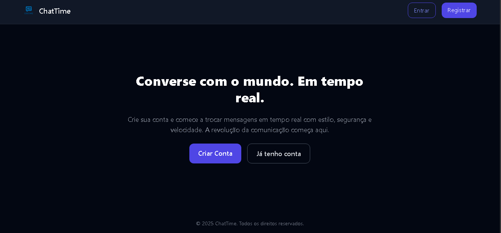

# 💬 ChatTime

ChatTime é um aplicativo de chat em tempo real com autenticação via Firebase, interface moderna com Tailwind CSS e backend usando Node.js + Socket.IO. Ideal para interações instantâneas entre usuários autenticados.

## 🚀 Tecnologias

- **HTML5 + Tailwind CSS** — Interface moderna e responsiva
- **Firebase Auth** — Autenticação de usuários
- **JavaScript (ESM)** — Scripts front-end modulares
- **Node.js + Express** — Backend
- **Socket.IO** — Comunicação em tempo real via WebSocket

## 📸 Preview



🔗 **[Clique aqui para abrir e testar o projeto](https://github.com)**

## 🔧 Pré-requisitos

- Node.js 18+
- Conta no Firebase com Auth ativado (método: Email/Senha)

## 🧪 Rodando Localmente

1. Instale as dependências:

```bash
npm install express socket.io
````

2. Suba o servidor backend:

```bash
node .
```

3. Acesse no navegador:

```
http://localhost:3000
```

## 📃 Licença

Este projeto está sob a licença **MIT**. Livre para uso e modificação.